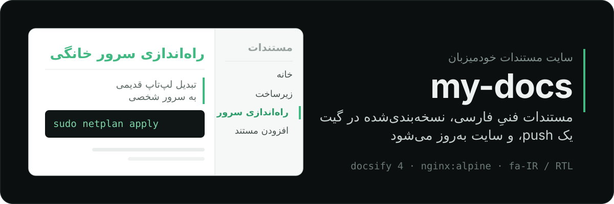
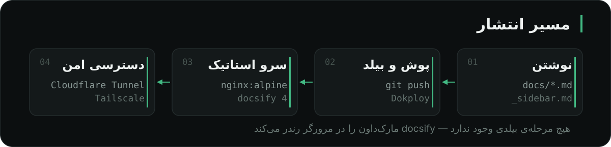

<p align="center">
  
</p>

این ریپو یک سایت مستندات کوچک و خودمیزبان است. هرچه را موقع ساختن زیرساخت شخصی‌ام یاد می‌گیرم به‌صورت Markdown همین‌جا می‌نویسم؛ یک `git push` کافی است تا چند دقیقه بعد روی سرور خانگی‌ام منتشر شده باشد. بدون دیتابیس، بدون مرحله‌ی بیلد و بدون وابستگی به سرویس بیرونی — فقط docsify و یک ایمیج `nginx:alpine`.

## چه چیزی اینجا هست

<div dir="rtl">

| مستند | چه چیزی را پوشش می‌دهد |
| --- | --- |
| **[راه‌اندازی سرور خانگی](docs/home-server.md)** | تبدیل یک لپ‌تاپ Sony Vaio به سرور شخصی: نصب Ubuntu Server، پیکربندی شبکه با netplan، جلوگیری از خوابیدن با بستن درب، سخت‌سازی SSH و fail2ban، سپس Docker، Dokploy، Cloudflare Tunnel و Tailscale — به‌همراه بخشی از خطاهایی که واقعاً پیش آمدند و راه‌حلشان |
| **[راهنمای دستورات Tailscale](docs/tailscale-cheatsheet.md)** | مرجع فارسی دستورهای خط فرمان تیل‌اسکیل: لاگین و اتصال، تفاوت `up` با `set`، exit node و subnet router، ‏Tailscale SSH، ‏Taildrop، ‏Serve و Funnel، ‏MagicDNS و عیب‌یابی با `ping` و `netcheck` — به‌همراه جدول خلاصه‌ی همه‌ی دستورها |
| **[افزودن مستند جدید](docs/contributing.md)** | قواعد نام‌گذاری فایل، ساختار سایدبار، سبک نوشتن، لینک بین صفحه‌ها و تست محلی |

</div>

هر دو صفحه از روی یک راه‌اندازی واقعی نوشته شده‌اند — با نسخه‌های مشخص، پیام‌های خطای واقعی و راه‌حل‌هایی که در عمل جواب دادند.

<div dir="rtl">

> سایت روی [vaio-server.tail71235c.ts.net/doc](https://vaio-server.tail71235c.ts.net/doc#/) منتشر شده است، ولی فقط از داخل tailnet باز می‌شود و آدرس عمومی نیست. اگر به این شبکه دسترسی نداری، [محلی اجرایش کن](#اجرای-محلی).

</div>

## چطور کار می‌کند

<p align="center">
  
</p>

<div dir="rtl">

| فایل | نقش |
| --- | --- |
| <code dir="ltr">docs/*.md</code> | محتوا. هر فایل، یک صفحه |
| <code dir="ltr">_sidebar.md</code> | منوی ناوبری. تنها جایی که برای افزودن صفحه باید ویرایش شود |
| `index.html` | پیکربندی docsify: چیدمان راست‌به‌چپ، جست‌وجو، کپی کد و هایلایت `bash` و `yaml` و `docker` و `nginx` |
| `Dockerfile` | ایمیج نهایی؛ همه‌ی فایل‌ها را داخل `nginx:alpine` کپی می‌کند |

</div>

هیچ مرحله‌ی بیلدی وجود ندارد؛ docsify فایل‌های Markdown را سمت مرورگر رندر می‌کند، پس ایمیج نهایی چیزی جز چند فایل استاتیک نیست. انتشار روی سرور با Dokploy انجام می‌شود و سایت از طریق Cloudflare Tunnel و Tailscale سرو می‌شود — هیچ پورتی روی مودم باز نیست. جزئیات کامل این زنجیره در [راه‌اندازی سرور خانگی](docs/home-server.md) آمده است.

## اجرای محلی

```bash
docker build -t my-docs .
docker run --rm -p 8080:80 my-docs
```

سپس <http://localhost:8080> را باز کن.

<div dir="rtl">

> فایل `Dockerfile` محتوای <code dir="ltr">docs/</code> را به ریشه‌ی وب‌سرور کپی می‌کند، بنابراین مسیرهای سایدبار مثل <code dir="ltr">/home-server.md</code> فقط داخل ایمیج درست کار می‌کنند. اجرای مستقیم docsify از ریشه‌ی ریپو همان ساختار را نمی‌سازد.

</div>

## افزودن یک صفحه

### ۱. فایل را بساز

```bash
touch docs/backup-strategy.md
```

نام فایل باید انگلیسی، با حروف کوچک و جداکننده‌ی خط تیره باشد. همین نام مستقیماً در آدرس صفحه ظاهر می‌شود، پس تغییر دادنش بعداً لینک‌های قبلی را می‌شکند.

### ۲. لینک را به سایدبار اضافه کن

فایل <code dir="ltr">_sidebar.md</code> را باز کن و یک خط زیر دسته‌ی مناسب بگذار:

<pre dir="ltr"><code>- زیرساخت
  - [استراتژی بکاپ](/backup-strategy.md)
</code></pre>

### ۳. کامیت و پوش کن

```bash
git add . && git commit -m "docs: add backup strategy" && git push
```

اگر `Auto Deploy` روشن باشد، Dokploy خودش بیلد و منتشر می‌کند؛ در غیر این صورت در پنل دستی `Deploy` بزن.

<div dir="rtl">

> مسیرهای سایدبار با `/` شروع می‌شوند و نسبت به ریشه‌ی سایت‌اند، نه نسبت به فایل فعلی. قواعد کامل نگارش، انکرهای فارسی و عیب‌یابی در [افزودن مستند جدید](docs/contributing.md) آمده است.

</div>

## قبل از push، این‌ها را ننویس

سایت داخل tailnet منتشر شده و **همه‌ی اعضای tailnet به آن دسترسی دارند**. رمز عبور، توکن، کلید API، محتوای <code dir="ltr">.env</code> و کلید خصوصی SSH جایی در این ریپو ندارند. اگر لازم است به مقداری اشاره کنی، placeholder بگذار:

```bash
export API_KEY="<YOUR_API_KEY>"
```
